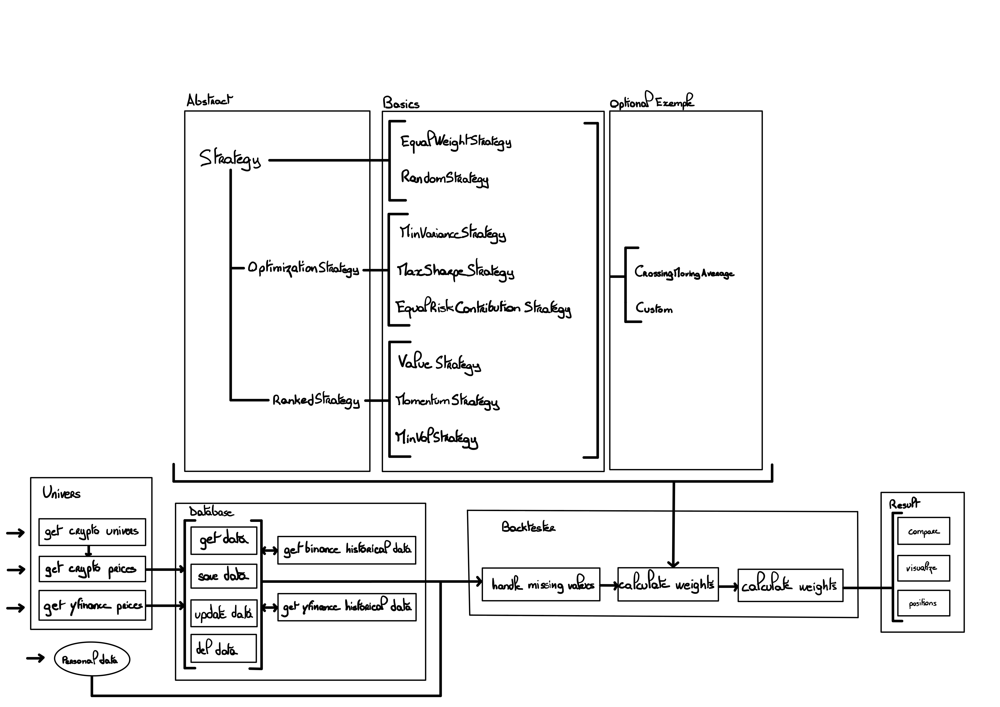

# Backtester272

**Version**: 1.0.2
**Auteurs**: Jules Mourgues-Haroche, Alexandre Remiat, Walid Boudini, Cassandre Amizet  

---

## Description

Backtester272 est un projet de backtesting permettant de tester des stratégies d'investissement sur des données historiques provenant de sources comme Binance et Yahoo Finance. Ce package offre une flexibilité dans la personnalisation des stratégies et permet d'exploiter des classes pour gérer les données, construire des univers de trading, et analyser les résultats.



---

## Fonctionnalités principales

1. **Backtesting complet** avec gestion des univers dynamiques.
2. **Stratégies prédéfinies** (pondération égale, minimisation de variance, maximisation du Sharpe, momentum, etc.).
3. **Intégration des données** de Binance et Yahoo Finance pour les cryptomonnaies et actions.
4. **Visualisations interactives** avec Matplotlib et Plotly.
5. **Analyse des métriques de performance** (CAGR, volatilité, drawdown, ratio de Sharpe, etc.).

---

## Structure du projet

```plaintext
├── .github/workflows/
│   └── test.yml               # Configuration GitHub Actions pour lancer les tests
├── backtester272/             # Package principal
│   ├── Backtester.py          # Classe principale pour exécuter le backtest
│   ├── DataBase.py            # Gestion des données historiques
│   ├── Result.py              # Analyse et visualisation des résultats
│   ├── Strategy.py            # Définitions des stratégies abstraites
│   ├── StrategyBank.py        # Stratégies implémentées
│   ├── Universe.py            # Construction des univers d'actifs
│   └── __init__.py            # Initialisation du package
├── examples/
│   ├── simple_examples.ipynb  # Exemple simple d'utilisation du backtester
│   └── data/database.csv      # Fichier CSV d'exemple
├── image/
│   └── draw.jpg               # Schéma de la structure du projet
├── pyproject.toml             # Configuration de gestion des dépendances
├── tests/
│   ├── test_backtester.py     # Tests unitaires pour Backtester
│   ├── test_universe.py       # Tests unitaires pour Universe
│   └── __init__.py            # Initialisation des tests
└── README.md                  # Documentation (ce fichier)
```

--- 

## Installation

Prérequis

- Python >= 3.9
- Poetry pour gérer les dépendances

Installation du projet

1. Clonez le dépôt :

```bash
git clone <URL_DU_DEPOT>
cd backtester272
```

2. Installez les dépendances :

```bash
pip install poetry
poetry install
```

3. Activez l’environnement virtuel :

```bash
poetry shell
```

---

## Utilisation

Exemple minimal d’utilisation

```python
# Initialisation de l'univers de trading avec un mode verbeux
univers = Universe(verbose=True)

# Sélection des symboles crypto appartenant à la couche "layer-1", limité à 50 tickers
tickers = univers.get_crypto_symbols("layer-1", 50)

# Définition de la période du backtest
start_date = '2015-01-01'
end_date = '2024-11-15'

# Récupération des données de prix des crypto-monnaies sélectionnées sur la période définie
crypto_prices = univers.get_crypto_prices(tickers, start_date, end_date)

# Instanciation du backtester avec les données de prix récupérées
crypto_bt = Backtester(crypto_prices)

# Exécution du backtest avec la stratégie "Equal Weight" (poids égal pour chaque actif)
ERC = crypto_bt.run(
    start_date, 
    end_date, 
    freq=30, 
    window=365, 
    aum=100, 
    transaction_cost=0.0, 
    strategy=EqualRiskContributionStrategy()
)

# Exécution du backtest avec la stratégie "Max Sharpe" (maximisation du ratio de Sharpe)
max_sharpe = crypto_bt.run(
    start_date, 
    end_date, 
    freq=30, 
    window=365, 
    aum=100, 
    transaction_cost=0.0, 
    strategy=MaxSharpeStrategy()
)

# Comparaison des résultats entre deux stratégies
ERC.compare(max_sharpe)
```

---

## Classes principales

1. Backtester

- Effectue le backtest en utilisant des données de prix et une stratégie définie.
- Principaux paramètres :
- data : pd.DataFrame des données de prix.
- start_date, end_date : Période du backtest.
- strategy : Objet d’une classe fille de Strategy.
- aum : Actifs sous gestion (par défaut : 100).
- transaction_cost : Coût des transactions en pourcentage.

2. Strategy

- Classe abstraite pour implémenter des stratégies d’investissement.
- Stratégies disponibles :
- EqualWeightStrategy : Poids égaux entre les actifs.
- RandomStrategy : Poids aléatoires normalisés.
- MomentumStrategy : Basée sur les rendements passés.
- MinVarianceStrategy : Minimisation de la variance.
- MaxSharpeStrategy : Maximisation du ratio de Sharpe.

3. Result

- Analyse les résultats d’un backtest.
- Méthodes principales :
- show_metrics() : Affiche les métriques de performance.
- visualize() : Visualise la performance du portefeuille.
- compare() : Permet de comparer plusieurs stratégies.
- positions() : Permet de visualiser l'évolution des positions.

4. Universe

- Gère les univers d’actifs en récupérant des données via CoinGecko, Binance, ou Yahoo Finance.

---

## Tests unitaires

Les tests sont définis dans le dossier tests/ et incluent des cas pour les classes principales.
Pour exécuter les tests :

```bash
poetry run pytest
```

---

## Licence

Ce projet est sous licence MIT.
